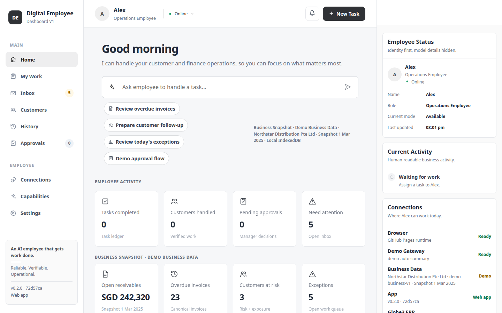
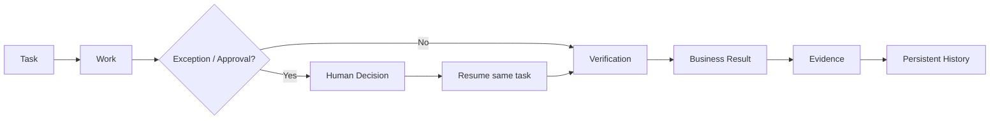
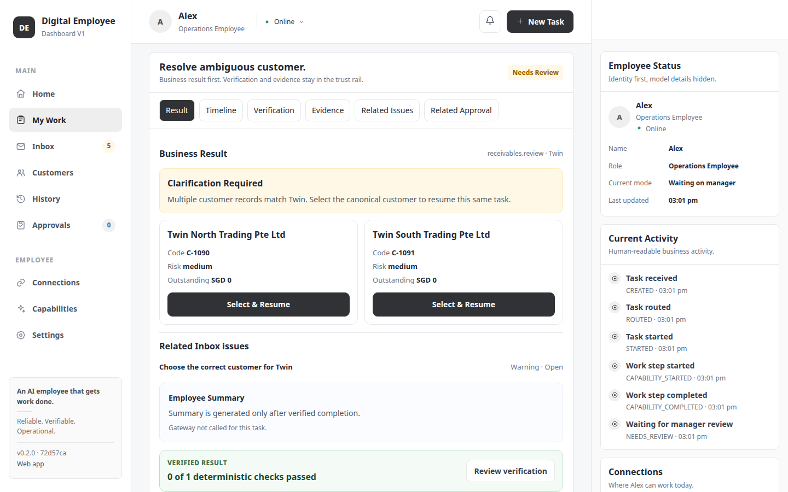
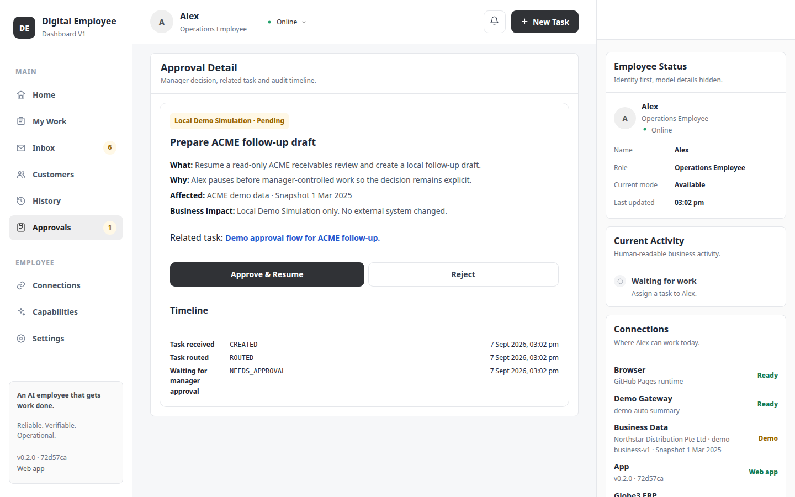
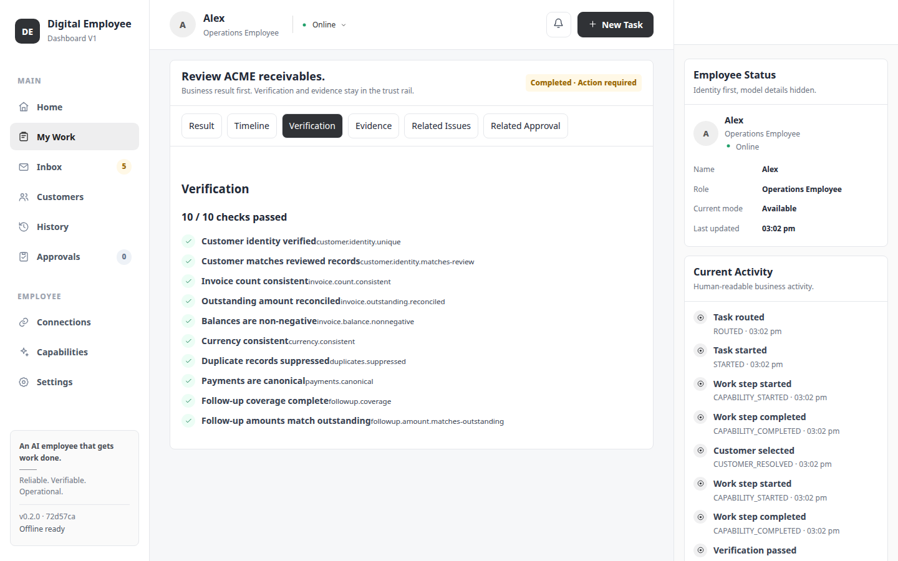
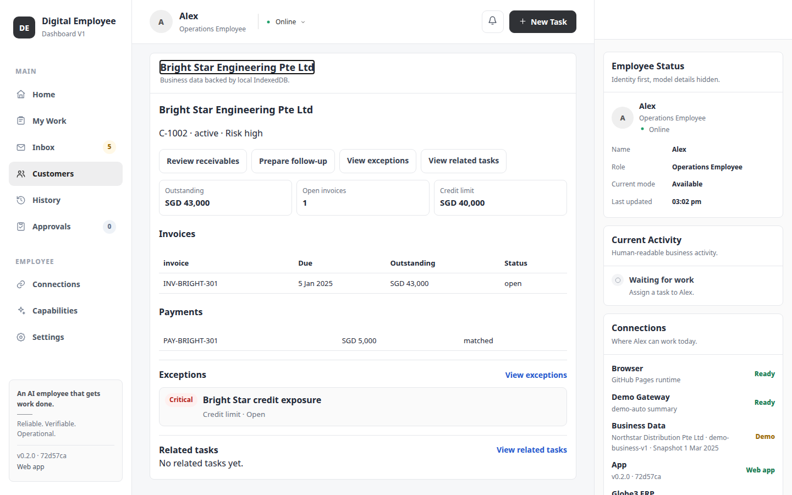
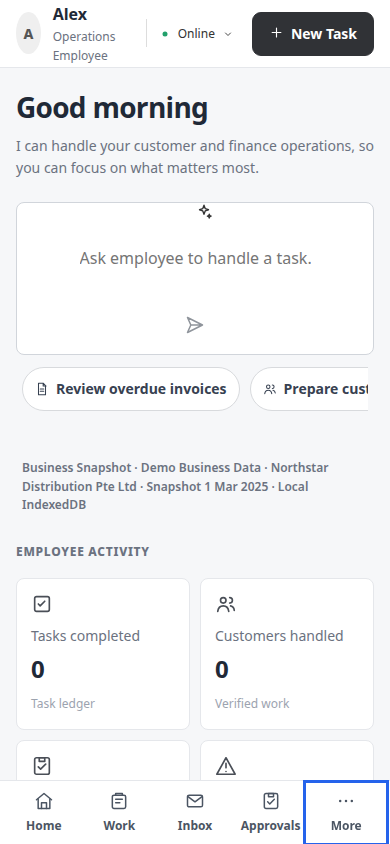
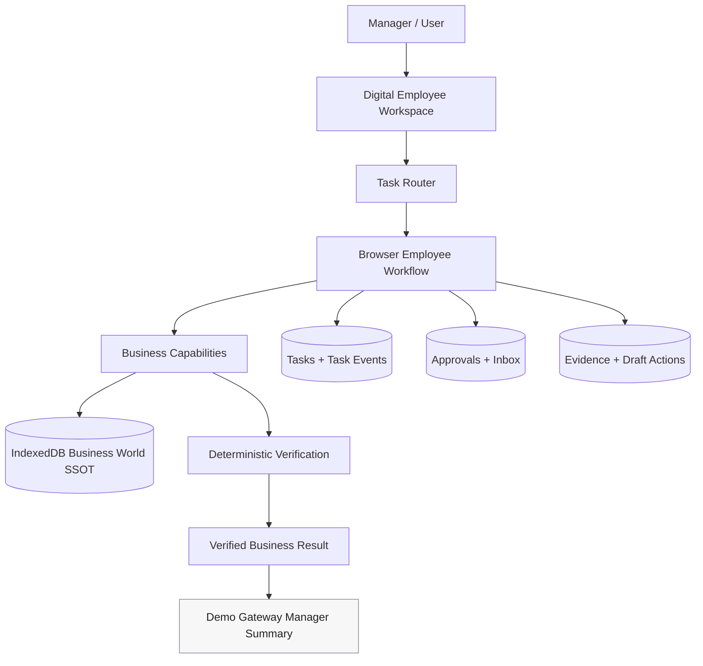

# Digital Employee

> A browser-first Digital Employee that performs business work, pauses for human decisions, verifies outcomes deterministically, and keeps auditable evidence.

**[Open the Live Demo](https://aiagent-sg-2026.github.io/pi-digital-employee-demo/)** · English · 简体中文 · 繁體中文 · PWA / offline-ready



## What is a Digital Employee?

A chatbot answers a message. A **Digital Employee owns a work lifecycle**.

In this demo, **Alex** is an Operations Employee. You assign business work; Alex creates a task, works through customer and finance data, pauses when a manager must decide, resumes the same task after that decision, verifies the outcome, and preserves the evidence and history.

The product is intentionally **work-first, not chat-first**:



The important rule is simple: **the model does not get to declare business completion just because it says it finished. Completion is gated by deterministic verification.**

## Try This First

The fastest way to understand the project is to run these four tasks from Home.

### 1. Verified Receivables Review

Assign:

```text
Review ACME receivables.
```

Watch Alex:

- resolve the customer,
- review invoices, payments and credit notes,
- prepare follow-up actions,
- run deterministic business checks,
- show the verified result,
- preserve execution evidence.

**Why it matters:** this demonstrates the normal work path from assignment to a business result that can be independently checked.

### 2. Human Review → Resume

Assign:

```text
Resolve ambiguous customer.
```

You should see:

- **Twin North Trading Pte Ltd** and **Twin South Trading Pte Ltd** as candidate cards,
- the task enter **Needs Review**,
- a human choose the canonical customer,
- `REVIEW_RESOLVED` appended to the same task timeline,
- the **same taskId** resume,
- receivables work and verification continue to completion.



**Why it matters:** the Digital Employee does not guess when business identity is ambiguous. It asks, records the decision, and continues the original work.

### 3. Approval → Resume

Assign:

```text
Demo approval flow for ACME follow-up.
```

Expected flow:

- task pauses in **Needs Approval**,
- manager sees what will happen, why, affected data and business impact,
- **Approve & Resume** creates only a local demo draft action,
- the same task resumes,
- verification runs,
- task completes.

You can also choose **Reject**. The task becomes Blocked, no draft action is created, and no external business system is changed.



**Why it matters:** work that resembles an external-impact action should pause before a manager-controlled decision.

### 4. Portfolio Work

Assign:

```text
Show overdue customers.
```

Alex performs a business-wide review instead of a single-customer lookup. The result includes overdue customer count, overdue amount, priority accounts, upcoming-due accounts, exceptions and deterministic portfolio checks.

**Why it matters:** the employee can operate across the Business World, not only on ACME.

## What makes this different from an AI chatbot?

| Chatbot pattern | Digital Employee pattern |
| --- | --- |
| Message → answer | Task → work lifecycle |
| Model says it is done | Deterministic verification gates completion |
| Ambiguity may become a guess | Ambiguity becomes Human Review |
| Confirmation is generic | Approval explains what / why / impact |
| Conversation is the history | Task ledger + events + evidence are the history |
| Tool details dominate | Business result first, machine evidence second |

## Product Walkthrough

### Verified Result → Verification → Evidence

The strongest trust surface is Task Detail. Business Result comes first; friendly verification labels keep their canonical technical IDs; raw machine evidence stays collapsed until requested.



### Customer Workspace

Customer Detail combines identity, risk, credit limit, outstanding receivables, invoices, payments, open exceptions and related tasks. Context actions either navigate to the relevant work or populate the composer for explicit assignment.



### Mobile

The same routed workspace works at 390×844 with bottom navigation, a More drawer, task cards, 44px touch targets and no horizontal overflow.



## Browser-first Architecture

The demo is deployable as a static GitHub Pages application. Business data and work state live locally in normalized IndexedDB stores; there is no browser-exposed provider API key.



**Demo Gateway is presentation only.** It receives verified facts after deterministic completion and produces a manager-friendly summary. It is not the source of business truth and cannot override verification.

The repository also retains a separate Pi portability proof from the earlier phase. The current Browser Business World path is deliberately repository/workflow-driven so the demo stays deterministic and auditable.

## Key Product Features

- **Work-first assignment** — Quick Actions and scenarios populate the composer; nothing auto-runs.
- **Multi-customer Business World** — customer, invoice, payment, credit-note and policy data in local IndexedDB.
- **Human Review → Resume** — ambiguous identity pauses instead of guessing.
- **Approval → Resume / Reject** — manager-controlled local simulation with explicit impact and audit events.
- **Actionable Inbox** — duplicate payments, unmatched payments, invoice disputes, credit exposure and ambiguity have domain-specific local actions.
- **Deterministic verification** — reconciliation, identity, currency, duplicate suppression, payment and follow-up invariants.
- **Evidence + history** — task events and evidence persist separately from business entities.
- **Routed workspace** — Home, Work, Inbox, Customers, History, Approvals, Task Detail, Capabilities, Connections and Settings have real destinations and deep links.
- **Localized product** — English, 简体中文 and 繁體中文 share one locale/formatter controller.
- **PWA** — installable, offline app shell with user-controlled **Update Now**.

## Routed Workspace

| Route | Purpose |
| --- | --- |
| `#/home` | Compact manager dashboard and task composer |
| `#/work` | Operational task queue with status/customer filters |
| `#/inbox` | Full actionable exception queue |
| `#/customers` | Searchable customer workspace |
| `#/customers/:customerId` | Customer account, exceptions and related work |
| `#/history` | Terminal / audit work |
| `#/approvals` | Manager decision queue |
| `#/approvals/:approvalId` | Approval impact, related task and timeline |
| `#/tasks/:taskId` | Result, Timeline, Verification, Evidence, Issues, Approval |
| `#/capabilities` | What Alex reads, may change, verifies and requires approval for |
| `#/connections` | Runtime / permission / demo-vs-real boundaries |
| `#/settings` | Language, PWA, Demo Data and About |

## IndexedDB Business World

Database: `digital-employee-dashboard-v1` · schema version `3`

Normalized stores:

```text
meta
customers
invoices
payments
creditNotes
followUpPolicies
tasks
taskEvents
approvals
inbox
evidence
draftActions
preferences
```

Business entities are kept separate from task events and historical evidence. Language preference also has its own `preferences` store instead of being folded into a giant application-state object.

## Demo Boundaries

This is intentionally an honest public demo:

- **Northstar Distribution Pte Ltd and its Business World are fictional demo data.**
- Business and task data are stored locally in the browser with IndexedDB.
- **Globe3 ERP is not connected** and no real ERP record is modified.
- **Gmail is not connected** and the demo does not send customer email.
- Approval actions are **Local Demo Simulation** only.
- Demo Gateway only summarizes facts that already passed deterministic verification.
- Gateway bearer tokens remain memory-only and are not persisted to IndexedDB, localStorage or sessionStorage.
- Service Worker caching is limited to same-origin static app-shell resources.
- Verification remains deterministic even when the manager summary is unavailable.

## Engineering Highlights

- Vanilla TypeScript + Vite; no framework rewrite required.
- Browser-first static deployment on GitHub Pages.
- Normalized IndexedDB as the local Business World SSOT.
- Event-based task ledger with deep-linkable Task Detail.
- Same-task Human Review resume with `REVIEW_RESOLVED`.
- Approval approve/resume and reject/block paths.
- Deterministic business invariant verification.
- Persistent task history without reload re-execution.
- English / Simplified Chinese / Traditional Chinese i18n.
- Versioned PWA app shell, offline restore and user-controlled updates.
- No analytics, session replay, tracking pixels or telemetry SDKs.
- No provider API key exposed in the browser.

## Local Development

```bash
npm install
npm test
npm run build
```

Development server:

```bash
npm run dev
```

Production preview after build:

```bash
npm run preview
```

The public demo is designed for GitHub Pages under the `/pi-digital-employee-demo/` base path.

## Quality Gates

The project maintains tests for:

- Business World repositories and workflows,
- Human Review and Approval resume behavior,
- deterministic verification,
- routing / deep-link contracts,
- i18n / IndexedDB preference durability,
- PWA update and offline behavior,
- presentation hierarchy and SVG-only icon policy.

Release QA also covers desktop and 390×844 mobile in `en`, `zh-CN` and `zh-TW`.

## Social Preview Direction

The current fallback is a **real production Home screenshot** in `public/social-preview.png`. The design specification for a future custom GitHub social preview is documented in [`docs/SOCIAL_PREVIEW.md`](docs/SOCIAL_PREVIEW.md).

---

Digital Employee V1 is a demonstration of a specific product idea: **AI should not merely say it did business work. It should leave behind a task, a decision trail, deterministic verification and evidence that a manager can inspect.**
